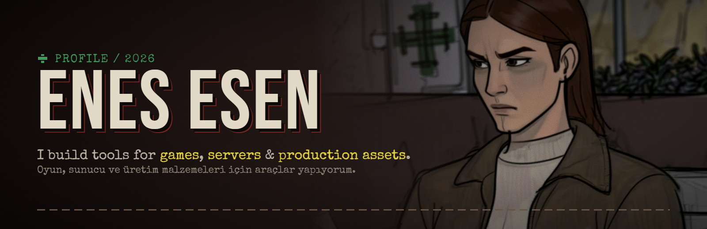
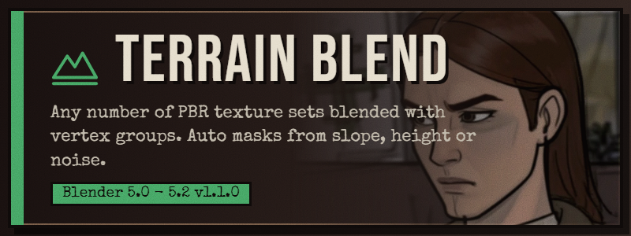
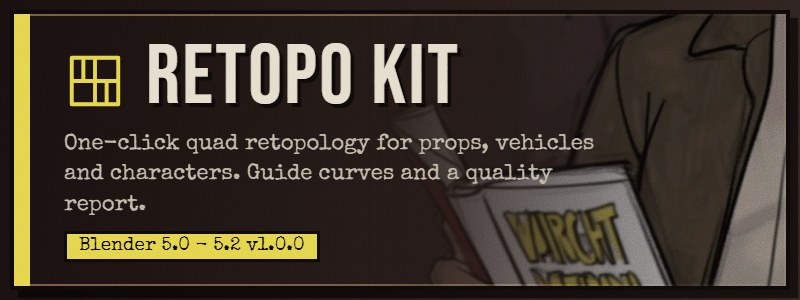
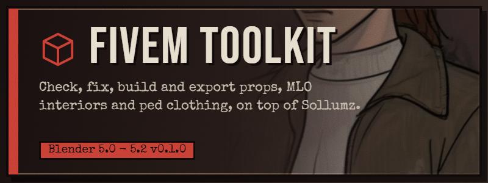
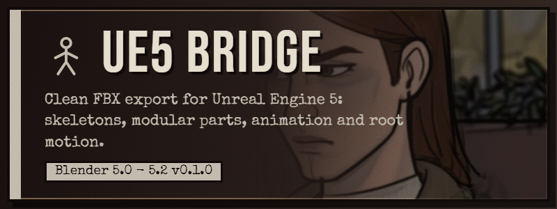
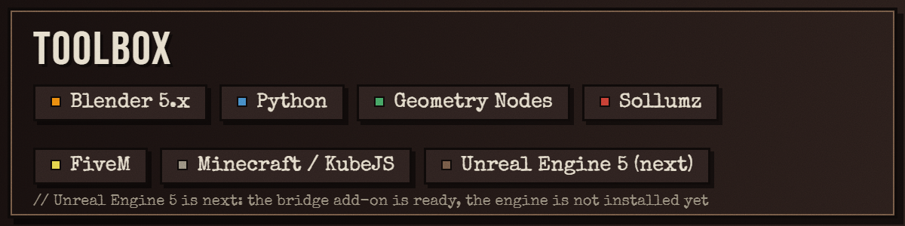

**Games · Servers · Production assets** &nbsp;|&nbsp; English & Türkçe

## 👋 Hi / Selam

I like removing the slow, repetitive parts of making game assets, so the hours at the keyboard go into making things
instead of clicking through menus. Right now that means Blender add-ons that run on **Blender 5.0 to 5.2**.

*Selam! Blender'da geçirdiğim saatlerde daha çok üretebilmek için, işi yavaşlatan tekrarlı kısımları ortadan kaldıran
araçlar yazıyorum.*

## 🧰 Blender Toolkit

Four free Blender add-ons (GPL-3.0), each with an English and a Turkish guide. Click a card to open its guide.

<table align="center">
  <tr>
    <td></td>
    <td></td>
  </tr>
  <tr>
    <td></td>
    <td></td>
  </tr>
</table>

<a href="https://github.com/EnesiEsen/blender-toolkit"><b>All four in one repository: EnesiEsen/blender-toolkit →</b></a>

## 🛠️ Toolbox

## 🎯 Right now

- Polishing the four add-ons in **blender-toolkit** and writing their guides in English and Turkish.
- **FiveM:** the prop, MLO interior and ped clothing pipeline on top of Sollumz.
- **Next:** trying the UE5 Bridge inside Unreal Engine 5, once the engine is installed.

## 📬 Contact

Open an issue on one of my repositories. Bug reports with the Blender version and the steps to reproduce are the most useful thing you can send.

Header art: the "Walter" drawing.

